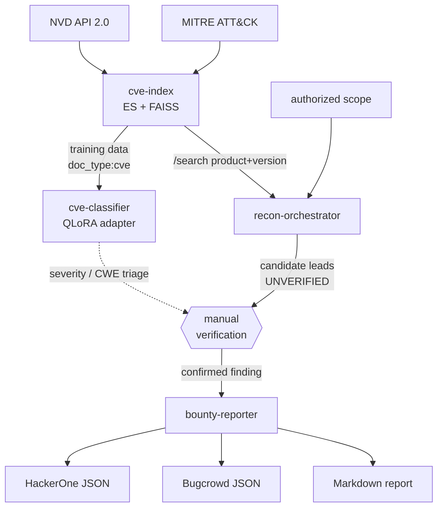

# security-harness

A toolkit for **authorized** vulnerability research and bug-bounty work, built as
four independent components that interlock through shared data. One long-running
service (a CVE knowledge base) plus three tools that read from it.

Each component lives in its own repo and is independently installable, testable,
and deployable. This document is the map: what each does, how they connect, and
how to run the whole thing.

## Scope & ethics (read first)

This harness is for testing you are **authorized** to perform — an active bug
bounty program you're enrolled in, a lab, or an asset you own.

- The recon component **refuses to run without an explicit authorized scope**,
  probes only hosts that clearly match that scope, and sends **GET/HEAD only** —
  no exploit payloads, no parameter injection, no evasion, no IP rotation.
- Every recon result is labelled **UNVERIFIED — manual verification required**.
  The harness surfaces *leads*; a human confirms them.
- The report generator **will not fabricate evidence** — it requires real repro
  steps, an observed result, and impact, and refuses to build a report without
  them.

By design, there is **no autonomous exploitation loop and no model trained to
optimize successful break-ins.** That was deliberately left out; what's here
finds and organizes attack surface for a human to verify.

## Components

| Component | Repo | Role | Runtime |
|-----------|------|------|---------|
| **harness** | [`harness`](harness) | TUI/CLI front door that drives all of the below | Interactive TUI |
| **cve-index** | [`cve-index`](cve-index) | Hybrid Elasticsearch + FAISS search over NVD + MITRE ATT&CK | Long-running service (API) |
| **cve-classifier** | [`cve-classifier`](cve-classifier) | QLoRA fine-tune → CVE severity + CWE classification | GPU batch job / inference |
| **recon-orchestrator** | [`recon-orchestrator`](recon-orchestrator) | Scope-gated, rate-limited recon → ranked candidate leads | Run-to-completion job |
| **bounty-reporter** | [`bounty-reporter`](bounty-reporter) | Structured finding → HackerOne/Bugcrowd JSON + Markdown + CVSS | CLI |

**Start here:** [`harness`](harness) is the front door — a Textual TUI where you
define a program once, then press `r` to run recon, browse ranked leads, and `w`
to scaffold a report. It calls the four components below so you don't have to
juggle their individual commands. The per-component docs are still the reference
for what each does under the hood.

## How they connect



`cve-index` is the hub: the classifier trains on it, recon correlates
fingerprints against it, and the reporter can verify CVE references against it.

## End-to-end run

### 1. Stand up the CVE knowledge base (the one real service)

```bash
cd ~/security-harness/cve-index
cp .env.example .env                 # optionally add CVE_NVD_API_KEY
docker compose up -d elasticsearch
pip install -e .
export CVE_NVD_MAX_RECORDS=5000      # bound the first pull while iterating
cve-index ingest --mode full         # fetch → embed → index → alias-swap → FAISS
cve-index serve                      # http://localhost:8080
```

### 2. Run the full pipeline for all programs (optional one‑shot command)

Once the services are up, you can execute the entire workflow for every defined program with a single command:

```bash
harness global
```

This will:
- Run the nightly pipeline (sub‑domain enumeration → port sweep → CPE‑based CVE lookup → sensitive‑path checks → scope import → scoring).
- Open the Triage dashboard so you can review ranked findings.
- Generate a consolidated Markdown + JSON report for each program under `~/hunts/<program>/`.
- Prompt once for HackerOne / Bugcrowd API keys (leave blank to skip upload) and, if supplied, POST the findings to the platforms.

All steps remain GET/HEAD‑only for recon and POST‑only for upload, require manual review before any data leaves your machine, and respect the program‑level allow/deny lists.

### 2. (Optional) Train the CVE classifier on that corpus

```bash
cd ~/security-harness/cve-classifier
pip install -e '.[train]'            # torch/transformers/peft/trl/bitsandbytes
export CLS_ES_URL=http://localhost:9200
cve-classifier build-dataset         # scans cve-index → data/train.jsonl, val.jsonl
cve-classifier train                 # QLoRA (GPU; 1.5B 4-bit fits ~4GB VRAM)
cve-classifier evaluate              # accuracy + macro-F1 for severity and CWE
```

### 3. Run scoped recon against an authorized target

```bash
cd ~/security-harness/recon-orchestrator
pip install -e .
export RECON_IN_SCOPE="example.com,*.example.com"
export RECON_OUT_OF_SCOPE="admin.example.com"
export RECON_SEEDS="www.example.com,api.example.com,dev.example.com"
export RECON_REQUESTS_PER_SECOND=2
export RECON_CVE_INDEX_URL=http://localhost:8080   # correlate versions → CVEs
recon-orchestrator run > candidates.json           # ranked leads, all UNVERIFIED
```

### 4. After you verify a lead by hand, write it up

```bash
cd ~/security-harness/bounty-reporter
pip install -e .
# edit a finding file (see examples/idor.yaml) with your verified evidence
bounty-reporter render my-finding.yaml --out ./out
#   -> out/<fp>.md  out/<fp>.hackerone.json  out/<fp>.bugcrowd.json
```

## Shared conventions

All four components follow the same patterns, so moving between them is
frictionless:

- **Config** via environment variables with a per-service prefix
  (`CVE_`, `CLS_`, `RECON_`, `RPT_`) — nothing hardcoded, `.env.example` in each.
- **Structured JSON logging to stderr**, so stdout stays clean for data output.
- **Pydantic models** at every boundary.
- **Pure logic split from heavy/IO deps**, so the core is unit-tested without
  torch, Elasticsearch, a GPU, or network access.
- **`src` layout + `pyproject.toml` + README** per repo; Docker/k8s where a
  service or scheduled job warrants it.

## Testing

```bash
# in each repo:
pip install -e '.[dev]' && pytest
```

| Repo | Unit tests (no infra) | Needs infra for |
|------|----------------------|-----------------|
| cve-index | parsing (NVD/STIX), RRF fusion | live ES + embedding model for search/ingest |
| cve-classifier | labels, prompts/parsing, metrics, dataset | GPU + cve-index for train/eval |
| bounty-reporter | CVSS vectors, model validation, dedup, taxonomy, generation | — (fully covered) |
| recon-orchestrator | scope logic, fingerprint, triage, rate limiter, pipeline | live hosts for a real probe run |

Verified without infrastructure: **82 unit tests across the four repos, all
passing.** The CVSS v3.1 calculator is checked against known vectors
(Log4Shell 10.0, `AV:N…C:H` 7.5, IDOR 6.5, null-impact 0.0); the scope guard is
checked against wildcard/exclusion/CIDR rules and the `example.com.evil.com`
bypass.

## Deployment notes

- **cve-index** ships `docker-compose.yml` (ES + API) and
  `k8s-reindex-cronjob.yaml` for a rolling 4-hour incremental refresh via the
  zero-downtime alias-swap pattern.
- **recon-orchestrator** and **cve-classifier** ship Dockerfiles; they run as
  jobs (recon to completion with graceful SIGTERM drain; the classifier as a
  training job), not always-on services.
- **bounty-reporter** is a CLI/library — no service to deploy.
