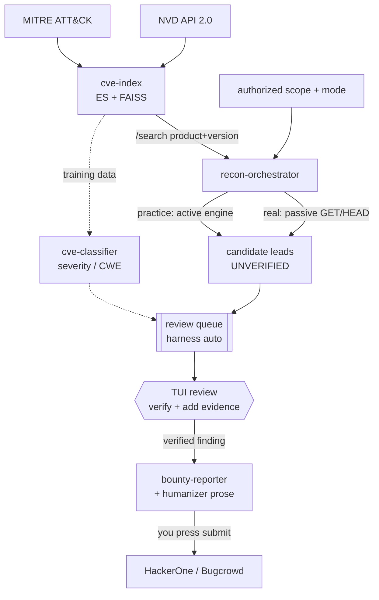

# security-harness

A toolkit for **authorized** vulnerability research and bug-bounty work, built as
four independent components that interlock through shared data, driven by a
front-door harness that runs the whole loop **headless** — recon → triage → a
review queue you work in the TUI. One long-running service (a CVE knowledge base)
plus three tools that read from it.

Each component lives in its own repo and is independently installable, testable,
and deployable. This document is the map: what each does, how they connect, and
how to run the whole thing.

## Scope & ethics (read first)

This harness is for testing you are **authorized** to perform — an active bug
bounty program you're enrolled in, a lab, or an asset you own. Every program
carries a **mode** that decides how far the machine may go on its own:

- **`real` programs** (a live bug-bounty target) stay **passive**: scope-gated
  recon that **refuses to run without an explicit authorized scope**, probes only
  hosts that clearly match it, and sends **GET/HEAD only** — no exploit payloads,
  no parameter injection, no evasion, no IP rotation. Results are labelled
  **UNVERIFIED — manual verification required**; the machine surfaces *leads*, a
  human confirms them. A `real` program is forced passive on every autonomous run
  regardless of any other flag.
- **`practice` programs** are **intentionally-vulnerable targets you own or are
  meant to exploit** (a local Juice Shop / DVWA, the public Acunetix vulnweb
  sites). Only these arm the active engine — crawl, parameter discovery, and
  crafted-input probing — because there is no third party to harm.

Two lines the machine never crosses on its own:

- **No auto-submission, ever.** Nothing in the autonomous path POSTs to a
  platform. You review each finding, add the evidence you verified by hand, and
  submit it yourself from the TUI.
- **No fabricated evidence.** The report builder requires real reproduction
  steps, an observed result, and impact, and **refuses** to build or submit a
  report without them — an unverified scan lead is never dressed up as a finding.

## Components

| Component | Repo | Role | Runtime |
|-----------|------|------|---------|
| **harness** | [`harness`](harness) | Front door: headless `auto` runner + a TUI review/submit cockpit driving all of the below | TUI + headless CLI |
| **cve-index** | [`cve-index`](cve-index) | Hybrid Elasticsearch + FAISS search over NVD + MITRE ATT&CK | Long-running service (API) |
| **cve-classifier** | [`cve-classifier`](cve-classifier) | QLoRA fine-tune → CVE severity + CWE classification | GPU batch job / inference |
| **recon-orchestrator** | [`recon-orchestrator`](recon-orchestrator) | Scope-gated, rate-limited recon → ranked candidate leads | Run-to-completion job |
| **bounty-reporter** | [`bounty-reporter`](bounty-reporter) | Structured finding → HackerOne/Bugcrowd JSON + Markdown + CVSS | CLI |

**Start here:** [`harness`](harness) is the front door. Define a program once,
then either let it run unattended — `harness auto` does recon + scan for every
program and fills a review queue — or open the TUI (`harness`) and press `f` to
work that queue: read each finding, mark it, add the evidence you verified, and
submit it. It calls the four components below so you don't juggle their
individual commands. The per-component docs remain the reference for the
internals.

## How they connect



`cve-index` is the hub: the classifier trains on it, recon correlates
fingerprints against it, and the reporter can verify CVE references against it.

## End-to-end run

### 1. Stand up the CVE knowledge base (the one real service)

```bash
cd ~/security-harness/cve-index
cp .env.example .env                 # optionally add CVE_NVD_API_KEY
docker compose up -d elasticsearch
pip install -e .
export CVE_NVD_MAX_RECORDS=5000      # bound the first pull while iterating
cve-index ingest --mode full         # fetch → embed → index → alias-swap → FAISS
cve-index serve                      # http://localhost:8080
```

### 2. Seed practice targets and run headless

```bash
harness seed-practice                # adds the vulnweb practice program (mode=practice)
harness auto                         # recon + scan every program, fill the review queue
harness auto --programs vulnweb      # or scope a run to a subset
```

`harness auto` is non-interactive — no TUI, no prompts, **no upload** — so it is
safe to run from cron or an agent. It starts the services, ingests the CVE corpus
once if the index is empty, runs each program **in its mode** (real → passive,
practice → active engine), and writes per-finding records to
`~/hunts/<program>/findings/`.

### 3. Review and submit in the TUI

```bash
harness                              # opens the cockpit; press f for the review queue
```

In the **Findings** queue, `r`/`f`/`x` mark a finding real / false / duplicate;
**Enter** opens it to add the evidence you verified by hand, **Ctrl+D** previews
the report (prose run through the humanizer, evidence left untouched), and
**Ctrl+S** submits it — with a confirm, only if the evidence is real and your API
keys are set in `~/.harness/.env`. Submission is the one action that POSTs, and it
only happens on your keypress. (`harness global` is the older interactive variant
of the same pipeline.)

### 4. (Optional) Train the CVE classifier on that corpus

```bash
cd ~/security-harness/cve-classifier
pip install -e '.[train]'            # torch/transformers/peft/trl/bitsandbytes
export CLS_ES_URL=http://localhost:9200
cve-classifier build-dataset         # scans cve-index → data/train.jsonl, val.jsonl
cve-classifier train                 # QLoRA (GPU; 1.5B 4-bit fits ~4GB VRAM)
cve-classifier evaluate              # accuracy + macro-F1 for severity and CWE
```

### 5. Run scoped recon directly (component-level)

```bash
cd ~/security-harness/recon-orchestrator
pip install -e .
export RECON_IN_SCOPE="example.com,*.example.com"
export RECON_OUT_OF_SCOPE="admin.example.com"
export RECON_SEEDS="www.example.com,api.example.com,dev.example.com"
export RECON_REQUESTS_PER_SECOND=2
export RECON_CVE_INDEX_URL=http://localhost:8080   # correlate versions → CVEs
recon-orchestrator run > candidates.json           # ranked leads, all UNVERIFIED
```

### 6. Write up a finding directly (component-level)

```bash
cd ~/security-harness/bounty-reporter
pip install -e .
# edit a finding file (see examples/idor.yaml) with your verified evidence
bounty-reporter render my-finding.yaml --out ./out
#   -> out/<fp>.md  out/<fp>.hackerone.json  out/<fp>.bugcrowd.json
```

## Shared conventions

All four components follow the same patterns, so moving between them is
frictionless:

- **Config** via environment variables with a per-service prefix
  (`CVE_`, `CLS_`, `RECON_`, `RPT_`) — nothing hardcoded, `.env.example` in each.
- **Structured JSON logging to stderr**, so stdout stays clean for data output.
- **Pydantic models** at every boundary.
- **Pure logic split from heavy/IO deps**, so the core is unit-tested without
  torch, Elasticsearch, a GPU, or network access.
- **`src` layout + `pyproject.toml` + README** per repo; Docker/k8s where a
  service or scheduled job warrants it.

## Testing

```bash
# in each repo:
pip install -e '.[dev]' && pytest
```

| Repo | Unit tests (no infra) | Needs infra for |
|------|----------------------|-----------------|
| cve-index | parsing (NVD/STIX), RRF fusion | live ES + embedding model for search/ingest |
| cve-classifier | labels, prompts/parsing, metrics, dataset | GPU + cve-index for train/eval |
| bounty-reporter | CVSS vectors, model validation, dedup, taxonomy, generation | — (fully covered) |
| recon-orchestrator | scope logic, fingerprint, triage, rate limiter, pipeline | live hosts for a real probe run |

Verified without infrastructure: **246 unit tests across the harness,
recon-orchestrator, and bounty-reporter suites, all passing** — covering the
mode/passive-vs-active bright line, the finding store, the humanizer, and the
uploader's refusal to submit unverified leads. The CVSS v3.1 calculator is
checked against known vectors
(Log4Shell 10.0, `AV:N…C:H` 7.5, IDOR 6.5, null-impact 0.0); the scope guard is
checked against wildcard/exclusion/CIDR rules and the `example.com.evil.com`
bypass.

## Deployment notes

- **cve-index** ships `docker-compose.yml` (ES + API) and
  `k8s-reindex-cronjob.yaml` for a rolling 4-hour incremental refresh via the
  zero-downtime alias-swap pattern.
- **recon-orchestrator** and **cve-classifier** ship Dockerfiles; they run as
  jobs (recon to completion with graceful SIGTERM drain; the classifier as a
  training job), not always-on services.
- **bounty-reporter** is a CLI/library — no service to deploy.
