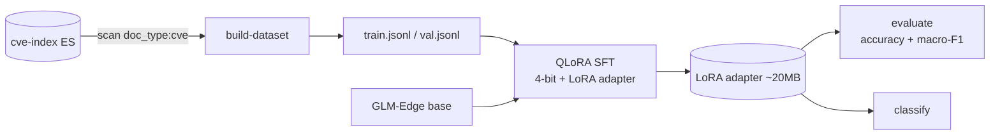

# cve-classifier

QLoRA fine-tuning pipeline that teaches a small instruction-tuned LLM to
classify CVEs on two axes:

- **severity** → `CRITICAL | HIGH | MEDIUM | LOW | UNKNOWN`
- **weakness** → normalized to the **CWE Top 25 (2023)** + `OTHER`

Training data is built automatically from the [`cve-index`](../cve-index)
Elasticsearch, so the classifier learns from the same corpus the search service
serves. The "learning loop" is a scheduled **re-train on newly published CVEs**
(keep the model current), not any live-target signal.

## Pipeline



## Install

```bash
pip install -e .            # dataset build + tests only (no torch)
pip install -e '.[train]'   # full QLoRA stack (torch, transformers, peft, trl, bitsandbytes)
```

## Use

```bash
# 1) Build the instruction dataset from cve-index (bound it while iterating)
export CLS_ES_URL=http://localhost:9200
cve-classifier build-dataset          # -> data/train.jsonl, data/val.jsonl

# 2) Fine-tune (GPU). 4-bit base fits a 1.5B model on ~4GB VRAM.
cve-classifier train

# 3) Score on the held-out val set
cve-classifier evaluate               # accuracy + macro-F1 for severity and CWE

# 4) Classify an ad-hoc description
cve-classifier classify "Path traversal in the file download endpoint lets a \
  remote user read arbitrary files" --product "acme fileserver"
# -> {"severity": "HIGH", "cwe": "CWE-22", "raw": "..."}
```

## Design notes

- **QLoRA**: `nf4` 4-bit quantization + double-quant, LoRA (r=16, alpha=32)
  applied to every linear projection. `CLS_LORA_TARGET_MODULES=auto` discovers
  module names at load time so swapping base models (GLM-Edge, Qwen, Llama) needs
  no code change.
- **Completion-only loss**: `DataCollatorForCompletionOnlyLM` masks the prompt
  so gradients only flow through the JSON answer.
- **Robust decoding**: `parse_prediction` tolerates prose/casing and forces any
  out-of-vocabulary label back to `UNKNOWN`/`OTHER`, so eval never crashes on a
  hallucinated label.
- The base model defaults to `THUDM/glm-edge-1.5b-chat`; set `CLS_BASE_MODEL` to
  anything on the Hub.

## Tests

```bash
pip install -e '.[dev]' && pytest
```

Pure-logic tests cover the label taxonomy, prompt building + prediction
parsing, metrics (accuracy / per-class PRF / macro-F1), and dataset
transformation, with no GPU or model download required. Training/eval
integration needs a GPU and a populated `cve-index`.
