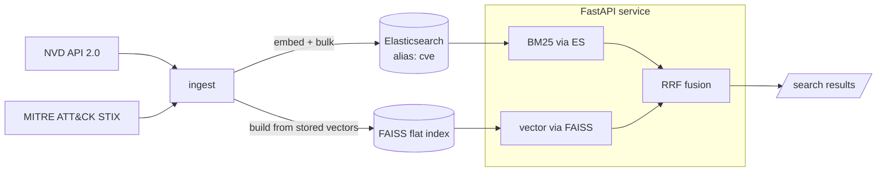

# cve-index

A hybrid **Elasticsearch + FAISS** knowledge base over **NVD** (CVEs) and
**MITRE ATT&CK** (techniques), with a FastAPI service for sub-second semantic +
keyword search. This is the searchable-CVE-database foundation for the wider
research harness: the QLoRA CVE classifier and the report generator both read
from this index.

## What it does

- **Ingests** the NVD 2.0 catalogue and the ATT&CK Enterprise STIX bundle,
  normalizes them into one document shape, embeds each with a
  sentence-transformer, and bulk-loads them into Elasticsearch.
- **Zero-downtime reindexing** via the alias-swap pattern: a fresh timestamped
  index is built and the read alias flips atomically; readers never see a
  partial index.
- **Hybrid search**: BM25 (Elasticsearch) and vector similarity (FAISS) run
  concurrently and are fused with Reciprocal Rank Fusion, so exact-id/keyword
  hits and semantic paraphrase hits both surface.
- **Production hygiene**: env-var config injection, structured JSON logging,
  connection pooling, retry with jittered exponential backoff on NVD, and
  lifespan-managed graceful shutdown.

## Architecture



## Quick start (local, Docker)

```bash
cp .env.example .env            # optionally add CVE_NVD_API_KEY
docker compose up -d elasticsearch

# Bound the corpus first time so you aren't pulling all ~250k CVEs:
export CVE_NVD_MAX_RECORDS=5000
pip install -e '.[dev]'
cve-index ingest --mode full     # fetch -> embed -> index -> alias swap -> FAISS

cve-index serve                  # http://localhost:8080
```

Or run the whole stack:

```bash
docker compose up --build
```

## Search

```bash
# HTTP
curl 'http://localhost:8080/search?q=log4j%20jndi%20rce&k=5&severity=CRITICAL'
curl -X POST localhost:8080/search -H 'content-type: application/json' \
     -d '{"q":"path traversal in file upload","k":10,"doc_type":"cve"}'
curl localhost:8080/cve/CVE-2021-44228
curl localhost:8080/technique/T1190
curl localhost:8080/health

# CLI
cve-index search "server-side request forgery" --k 5 --severity HIGH
```

Filters: `doc_type` (`cve` | `attack_technique`), `severity`, `min_score`, `cwe`.

## Refresh

- **Incremental** (only CVEs modified in the last N days):
  `cve-index ingest --mode update --days 1`
- **Kubernetes**: `k8s-reindex-cronjob.yaml` runs the incremental update every
  4 hours against a shared FAISS PVC.

## Config

Every value is environment-driven with the `CVE_` prefix (see `.env.example` and
`src/cve_index/config.py`). Nothing is hardcoded: URLs, keys, and hosts all
come from the environment.

## Tests

```bash
pip install -e '.[dev]'
pytest                 # pure-logic tests (parsing + fusion), no ES/model needed
```

The parsing and rank-fusion logic is unit-tested without external services.
Index/search integration tests require a live Elasticsearch and the embedding
model; run them against the `docker compose` stack.

## Notes / assumptions

- Embedding model defaults to `all-MiniLM-L6-v2` (384-dim, CPU-friendly). Set
  `CVE_EMBEDDING_MODEL` / `CVE_EMBEDDING_DEVICE` to change.
- `dense_vector` is stored (`index:false`) so FAISS owns vector search and ES
  stays lean; FAISS is rebuilt by scanning those stored vectors.
- A free NVD API key raises the rate limit from 5 to 50 req/30s and is strongly
  recommended for a full pull.
