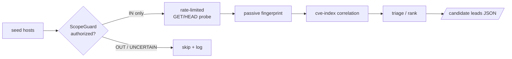

# recon-orchestrator

An async, single-target reconnaissance orchestrator for **authorized** bug
bounty / pentest work. It enumerates and fingerprints the hosts you point it at,
correlates versions against a running `cve-index`, and produces a **ranked list
of candidate leads for manual verification**.

## What it does — and deliberately does not

- **Does:** scope-gate every host, probe live hosts (GET/HEAD only), read response headers/titles, fingerprint product+version, match versions to CVEs in `cve-index`, and rank hosts by how much manual attention they deserve. **New in this branch:** when enabled, it can also send crafted payload requests to test for IDOR, XSS, SSRF, SQLi, auth bypass, and business‑logic bugs.
- **Does not:** send exploit payloads, inject parameters, brute-force, rotate IPs, or attempt evasion. Every result is labelled *UNVERIFIED — manual verification required*. It surfaces leads; a human confirms them.

- **Does:** scope-gate every host, probe live hosts (GET/HEAD only), read
  response headers/titles, fingerprint product+version, match versions to CVEs
  in `cve-index`, and rank hosts by how much manual attention they deserve.
- **Does not:** send exploit payloads, inject parameters, brute-force, rotate
  IPs, or attempt evasion. Every result is labelled *UNVERIFIED — manual
  verification required*. It surfaces leads; a human confirms them.



## Safety model

- **ScopeGuard** encodes real scope rules: a bare apex is not a wildcard, exclusions beat includes, `a.example.com.evil.com` is rejected, and anything ambiguous is `UNCERTAIN` — which the orchestrator treats as *do not touch*. Only a clean `IN` verdict is ever probed.
- **Refuses to run** without an explicit authorized scope.
- **Rate-limited** by a token bucket tuned to the program's published limit (politeness, not evasion) with bounded concurrency.
- **Graceful shutdown**: SIGINT/SIGTERM stop new work, drain in-flight probes, and emit what was gathered.

## Active payload testing (new in this branch)

The orchestrator can now, when explicitly enabled, send crafted HTTP requests to probe for vulnerabilities that require payloads (IDOR, XSS, SSRF, SQLi, auth bypass, business‑logic). This is **still fully scoped** and **rate‑limited**.

**How to enable**
```bash
export RECON_ACTIVE_TESTS=1  # or add to .env
# Optional: dry‑run to see what would be sent without actually sending
export RECON_DRY_RUN=1
recon-orchestrator run --seed staging.example.com
```

**What it does**
- Generates a small set of POST/GET requests using the vectors defined in `recon_orchestrator/payloads.py`.
- Sends them with the same async HTTP client used for normal probing.
- Applies lightweight heuristics (reflected payload detection, unexpected success codes) to flag suspicious responses.
- Flags are added to the host’s candidate finding and give a modest priority boost (`+2` per signal).

**Safety notes**
- Still respects `RECON_IN_SCOPE`/`RECON_OUT_OF_SCOPE` and will **never** probe hosts outside the declared scope.
- Rate‑limited by the same token bucket as normal probing; you can set `RECON_REQUESTS_PER_SECOND` to control traffic.
- All findings remain **UNVERIFIED** – the tool never claims exploitation. It only surfaces leads for manual review.
- Use `--dry-run` to preview the payload set without sending any requests.

- **ScopeGuard** encodes real scope rules: a bare apex is not a wildcard,
  exclusions beat includes, `a.example.com.evil.com` is rejected, and anything
  ambiguous is `UNCERTAIN` — which the orchestrator treats as *do not touch*.
  Only a clean `IN` verdict is ever probed.
- **Refuses to run** without an explicit authorized scope.
- **Rate-limited** by a token bucket tuned to the program's published limit
  (politeness, not evasion) with bounded concurrency.
- **Graceful shutdown**: SIGINT/SIGTERM stop new work, drain in-flight probes,
  and emit what was gathered.

## Use

```bash
pip install -e .

export RECON_IN_SCOPE="example.com,*.example.com"
export RECON_OUT_OF_SCOPE="admin.example.com"
export RECON_SEEDS="www.example.com,api.example.com,dev.example.com"
export RECON_REQUESTS_PER_SECOND=2
export RECON_CVE_INDEX_URL=http://localhost:8080   # optional CVE correlation

recon-orchestrator run                    # -> candidate leads JSON on stdout
recon-orchestrator run --seed staging.example.com
```

Scope and seeds can also come from files (`RECON_SCOPE_FILE=scope.yaml`,
`RECON_SEEDS_FILE=seeds.txt`). See `.env.example` and `scope.example.yaml`.

Output feeds the wider harness: a verified lead becomes the input to
`bounty-reporter`, and the CVE candidates come straight from `cve-index`.

## Tests

```bash
pip install -e '.[dev]' && pytest
```

Covered without any network: scope logic (wildcards, exclusions, CIDR, bypass
rejection), passive fingerprinting, triage ranking, the token-bucket math, and
an end-to-end pipeline test with a stub prober proving out-of-scope hosts are
never touched.
